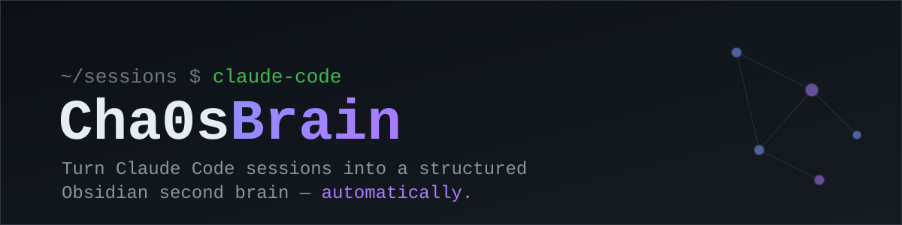
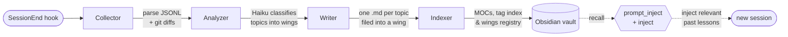

<p align="center">
  
</p>

<p align="center">
  
  
  
  
  
</p>

# Cha0sBrain

> Turn Claude Code sessions into a structured Obsidian second brain — automatically.

Cha0sBrain is a hook-driven pipeline that watches every [Claude Code](https://claude.com/claude-code)
session and distills it into clean, navigable Markdown notes for an
[Obsidian](https://obsidian.md) vault. When a session ends, it extracts the
knowledge that was actually created — how a feature was built, how a bug was
solved, what an evaluation concluded — and files it as a permanent, searchable
entry. Later sessions get that knowledge injected back in, so the same mistake
isn't made twice and the same research isn't repeated.

It runs entirely on the Claude Code subscription's own `claude` CLI (no separate
API key) and an optional local embedding model — no cloud services, no data
leaving the machine.

## Why

Every coding session produces knowledge that normally evaporates the moment the
window closes. Cha0sBrain closes that loop:

- **Capture** — a `SessionEnd` hook turns each session into 0–N structured notes.
- **Organize** — notes are filed by *theme* ("wings") rather than by project, so
  a networking lesson learned in project A is found again from project B.
- **Recall** — a `UserPromptSubmit` hook scores the vault against the current
  prompt and injects the most relevant past lessons back into the session.

The result is a growing, self-maintaining knowledge base that a human can browse
without any AI in the loop, and that Claude can draw on automatically.

## How it works



Three entry types are produced, each with its own writer prompt:

| Type | For | Example |
|---|---|---|
| **How-To** (`anleitung`) | generalized features / procedures | "Set up a systemd user timer" |
| **Troubleshooting** | bugs and their fixes | "401 after OAuth token refresh race" |
| **Research** (`recherche`) | evaluations and comparisons | "MemPalace vs. custom vault, evaluated" |

### What an entry looks like

A single troubleshooting session becomes a self-contained note, filed under the
`devtools/` wing with machine-readable frontmatter for search and RAG:

```markdown
---
title: 401 after OAuth token refresh race
type: troubleshooting
wing: devtools
tags: [oauth, claude-cli, refresh-token, subprocess]
project: example-app
created: 2026-04-07
---

# 401 after OAuth token refresh race

**Symptom.** Two `claude` processes on the same machine refresh the shared
login token at the same time; one persists an empty `refreshToken` and every
process starts failing with `401`.

**Fix.** Give the background process its own non-rotating setup token via
`CLAUDE_CODE_OAUTH_TOKEN` so it never touches the rotating login credentials.

**Why it works.** Token rotation invalidates siblings; an isolated inference
token is never part of that rotation. *(Analogy: give the night-shift worker
their own key instead of passing the one shared key around.)*
```

> Notes are written for a junior/hobby reading level — inline jargon
> explanations, everyday analogies, and a second worked example per entry.

A second path handles **recall**: `prompt_inject.py` (`UserPromptSubmit`) injects
and `prompt_inject.py` (`UserPromptSubmit`) ranks vault entries against each
prompt — lexical scoring by default, with an **optional semantic layer** on top
(local `nomic-embed-text` via [Ollama](https://ollama.com)). Without Ollama it
degrades gracefully to pure lexical matching; nothing breaks.

## Architecture

Modular pipeline — every stage is a pure-ish unit with one job:

| File | Role |
|---|---|
| `brain.py` | Entry point (`SessionEnd` hook). Orchestrates the pipeline; also a `--backfill` mode for hosts where the hook doesn't fire reliably. |
| `collector.py` | Parses the session `.jsonl` from `~/.claude/projects/…`, collects git diffs. |
| `analyzer.py` | Sends the session to Haiku, gets back classified topics as JSON, assigns each a wing. |
| `writer.py` | Generates one Markdown file per topic at `vault/{wing}/{slug}.md`. |
| `indexer.py` | Builds wing MOCs, a global MOC, the tag index and the wings registry — purely programmatic, no LLM call. |
| `prompt_inject.py` | `UserPromptSubmit` hook — injects the most prompt-relevant past lessons. |
| `vaultlib.py` | Frontmatter parser, tag index, DE/EN tokenizer, relevance scoring/ranking. |
| `semantic.py` / `build_embeddings.py` | Optional embedding layer over Ollama `nomic-embed-text`. |
| `stylecheck.py` / `lint.py` | Deterministic entry validator + vault-wide incremental linter with quarantine. |
| `health.py` | Weekly health report from the logs (pipeline activity, gate fails, quarantine, top warnings). |

Design principles worth calling out:

- **Anti-recursion** — a `CHA0SBRAIN_RUNNING=1` env var stops the pipeline's own
  `claude` calls from re-triggering the `SessionEnd` hook.
- **Idempotent** — a session is turned into notes exactly once, tracked in
  `logs/processed_sessions.json`.
- **Draft-then-validate** — a deterministic `stylecheck` gate rejects malformed
  entries (e.g. LLM conversational preambles) before they reach the vault.
- **Token-safe** — smart truncation keeps the analyzer prompt bounded while
  preserving the JSON instruction and the freshest session context.
- **Isolated inference token** — the analyzer can use a dedicated, non-rotating
  `CLAUDE_CODE_OAUTH_TOKEN` so it never touches the machine's rotating login
  credentials (avoids a refresh-token race that caused intermittent 401s).

## Setup

Requirements: **Python 3.10+**, the **`claude` CLI** on your `PATH` (Claude Code,
logged in), and — for the semantic recall layer only — **[Ollama](https://ollama.com)**
with the `nomic-embed-text` model.

```bash
# 1. Clone
git clone https://github.com/Cha0smast3r110/Cha0sBrain.git
cd Cha0sBrain

# 2. Create a virtualenv and install deps (only pyyaml)
python3 -m venv .venv
source .venv/bin/activate
pip install -r requirements.txt

# 3. Create your config from the template
cp config.json.example config.json
#    then edit config.json — at minimum set "vault_path" (see Configuration below)

# 4. (Optional) enable semantic recall
ollama pull nomic-embed-text
python build_embeddings.py          # builds vault/_embeddings.json
```

### Wire up the hooks

Cha0sBrain runs as three [Claude Code hooks](https://docs.claude.com/en/docs/claude-code/hooks).
Add them to your `~/.claude/settings.json` (adjust the absolute paths to where you
cloned the repo):

```json
{
  "hooks": {
    "SessionEnd": [
      { "hooks": [ { "type": "command", "timeout": 900,
        "command": "python3 /path/to/Cha0sBrain/brain.py" } ] }
    ],
    "SessionStart": [
      { "hooks": [ { "type": "command", "timeout": 5,
        "command": "python3 /path/to/Cha0sBrain/prompt_inject.py" } ] }
    ],
    "UserPromptSubmit": [
      { "hooks": [ { "type": "command", "timeout": 5,
        "command": "python3 /path/to/Cha0sBrain/prompt_inject.py" } ] }
    ]
  }
}
```

Only `SessionEnd` (capture) is required — `SessionStart` and `UserPromptSubmit`
(recall) are additive and can be added later.

On hosts where `SessionEnd` doesn't fire reliably (e.g. long-lived daemons), run
the capture step on a timer instead:

```bash
python3 /path/to/Cha0sBrain/brain.py --backfill --since-days 7
```

## Configuration

All configuration lives in `config.json` (git-ignored — copy it from
`config.json.example`):

| Key | What it does | Default |
|---|---|---|
| `vault_path` | **Absolute path** to your Obsidian vault. Wing folders and index files are created under here. Notes themselves are never committed to this repo. | — (required) |
| `model` | Which `claude` CLI model the analyzer/writer use. `haiku` is the cheap, fast default. | `haiku` |
| `log_level` | Python log level for `logs/brain.log`. | `INFO` |
| `push_vault_to_remote` | If `true`, the vault is `git push`ed after each run (useful when the vault is its own synced repo). | `true` |
| `emit_docs_solutions` | If `true`, troubleshooting entries are also emitted as `docs/solutions/…` files in the *project* being worked on. | `false` |

**Optional — isolated inference token.** To keep the analyzer's `claude` calls off
your rotating login credentials, drop a non-rotating setup token in a file the
analyzer reads (path via `CHA0SBRAIN_OAUTH_TOKEN_FILE`, default
`~/.config/cha0sbrain/claude_oauth.env`, `chmod 600`):

```bash
mkdir -p ~/.config/cha0sbrain
printf 'CLAUDE_CODE_OAUTH_TOKEN=%s\n' 'sk-ant-oat01-YOUR_TOKEN' > ~/.config/cha0sbrain/claude_oauth.env
chmod 600 ~/.config/cha0sbrain/claude_oauth.env
```

If no token file exists, Cha0sBrain simply falls back to the default `claude`
login — the feature is opt-in.

## Usage

Once the hooks are wired up, there's nothing to run manually — Cha0sBrain works
in the background. Useful commands:

```bash
python health.py --since 7d          # pipeline health report
python -m lint --full                # re-lint the whole vault (auto-fix + quarantine)
python -m lint --show-warnings       # surface soft warnings
python build_embeddings.py           # rebuild the semantic index
```

## Tests

```bash
python -m pytest tests/ -v
```

The suite (15 test modules) covers the collector, analyzer, writer, indexer,
injectors, style validator, linter and telemetry — using synthetic session
fixtures, so no real vault data is needed to run it.

## License

[MIT](LICENSE)
